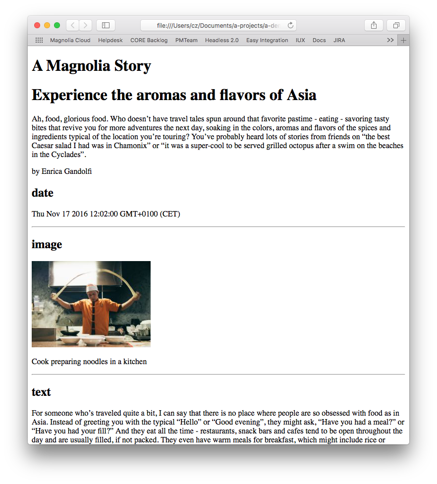

# simple-headless-demo

Demonstrates simple scenarios of accessing content from Magnolia REST endpoints and rendering the content via browser-side code.

Two scenarios are included:
* __Read and display content__
* __Read and display a 'Story'__

# Hosted Rndpoints
The two 'frontends' (mag-pages.html and mag-story.html) hit the hosted Magnolia demo at https://demopublic.magnolia-cms.com by default for their content.

You can try them by simply opening the files in a browser.

The `light-modules` directory is only used if you run the demo against a local Magnolia server. See the bottom of the README for how to do this.

# Read and display content:

## mag-pages.html

This is the simplest example of getting and displaying content via REST.

It access two `areas` from a `page` in the `website` workspace.
But it is applicable to any scenario or content, not just pages.

# Read and display a 'Story':

## mag-story.html

This is a simple example of getting and displaying the content from a Story via REST.

The Magnolia 'Stories app' (aka the 'Content Editor') has a flexible content model. A story contains some `outline` information at the root, and a list of `blocks` which can each have different `types`.

### Rendering the blocks
The `@nodes` array contains a list of the names of the nodes in their actual `JCR` order. So we iterate this array, and use the name to get the actual node content from the parent object.
With each node, we check that it is actually a block (that it has `@nodeType` of `mgnl:block`) and if so, then we call a different render function based on the type of the block (`mgnl:type`).

# Local Magnolia Server Setup
This is optional, but you might want to try the demo against your own server.
In particular the images in the Stories demo will only display if you run them on a local server. (Because the hosted server does not have image renditions configured.)

Change the `const RUN_ON_HOSTED_DEMO = false;` to `true` at the top of the `mag-pages.html` and `mag-story.html` files.

To install and run Magnolia, you'll need Java and npm installed.
Here's a guide for that: https://documentation.magnolia-cms.com/display/DOCS61/Installing+Magnolia

Should work on Magnolia 5.6.5 and above. Tested most recently on Magnolia 6.1.

* Install the Magnolia CLI globally with `npm install @magnolia/cli -g`. This installs the (handy-dandy) `mgnl` command.

* Get a Magnolia server by running `mgnl jumpstart` in the root of this repository.
Choose option 5, `magnolia-dx-core-demo-webapp`.
(You need this webapp because 1. Stories app is not supported on community edition, and 2. it contains the sample content.)

By installing in this location, the Magnoila server will automatically load the definitions stored in the included `light-modules` directory. You will see that the REST endpoints are configured there.

* Start the Magnolia server with `mgnl start`.

* Log into the Author and Public instance, you will need to do that on both servers because you will need to provide your enterprise credentials.

# License

MIT

## Contributors

Magnolia, https://magnolia-cms.com

Christopher Zimmermann, @topherzee
